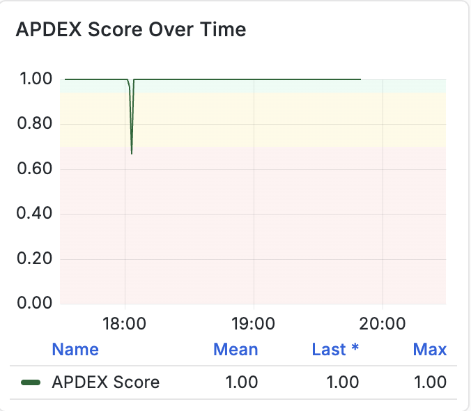
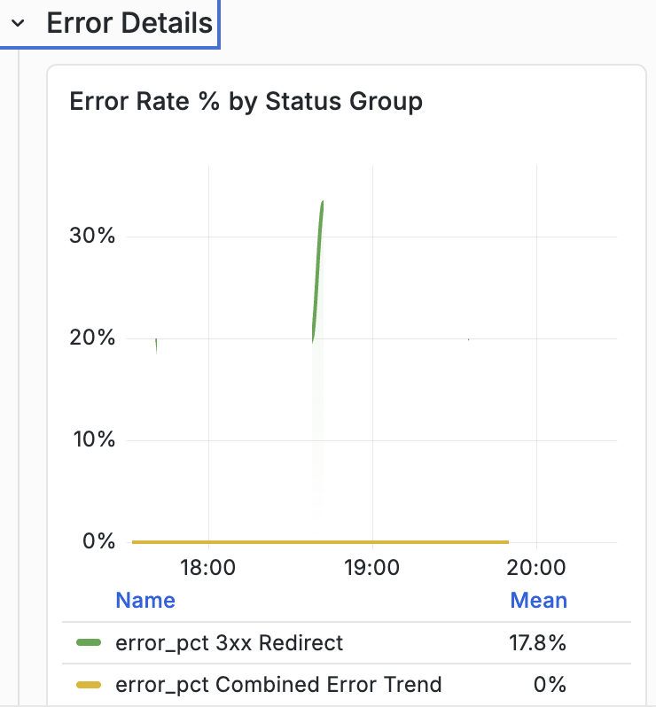

# Monitoraggio delle prestazioni delle applicazioni (APM) con [!DNL Synoptryx] {#application-performance-monitoring}

Il monitoraggio delle prestazioni delle applicazioni (APM) di [!DNL Synoptryx] fornisce dati cronologici e in tempo reale di insight nelle prestazioni di Adobe [!DNL Experience Manager] (AEM) e nell&#39;esperienza dell&#39;utente finale. Traccia delle transazioni, grafici e report end-to-end forniscono visibilità sul comportamento dell&#39;applicazione fino al livello di codice Java.

## Plug-in APM di Managed Services [!DNL Synoptryx] {#apm-plugin}

AEM funziona come applicazione Java su Jetty con moduli OSGi Apache Felix, basati su Apache Sling e Jackrabbit Oak. Adobe Managed Services, AEM Engineering e [!DNL Synoptryx] Engineering hanno sviluppato congiuntamente strumenti personalizzati per gli ambienti Managed Services.

Tale strumentazione raccoglie:

- **Denominazione significativa delle transazioni**. Le estensioni Sling allineano i nomi delle transazioni alla struttura della pagina e aggiungono un attributo `requestURL` agli eventi Insights in modo da poter correlare gli URL Sling tra dashboard diversi.


- **Strumentazione JCR**: le operazioni a livello di repository (inclusi XPath e JCR-SQL2) sono categorizzate e collegate alle tracce delle transazioni nella sezione database di APM.


## Utilizzo di [!DNL Synoptryx] APM {#using-apm}

Utilizzare APM per individuare i problemi dell&#39;applicazione prima che interessino gli utenti finali. Autore e Pubblicazione condividono una base di codice ma sono monitorati come **applicazioni APM separate** in modo da poter analizzare ogni livello in modo indipendente.

Ogni ambiente Managed Services include:

- Un’applicazione APM per l’authoring
- Un&#39;applicazione APM per la pubblicazione

Selezionare il nome di un&#39;applicazione nell&#39;APM [!DNL Synoptryx] per aprire la relativa dashboard di panoramica e monitoraggio.


## Sezioni del dashboard

Il dashboard Gestione prestazioni applicazioni contiene le sezioni seguenti:

- Panoramica
- Metriche RED (Frequenza · Errori · Durata)
- Traffico
- Latenza e prestazioni
- Dettagli errore
- Prime transazioni
- Integrità JVM
- Memoria JVM
- Raccolta oggetti inattivi

Solo le sezioni mostrate di seguito sono documentate in questa guida.

## Navigazione dashboard


Il dashboard è organizzato in sezioni espandibili che raggruppano le metriche delle prestazioni delle applicazioni correlate. Quando si espande una sezione vengono visualizzati uno o più grafici associati a tale categoria.

## Panoramica


### Descrizione

La sezione **[!UICONTROL Panoramica]** presenta indicatori prestazioni chiave (KPI) di alto livello che riepilogano lo stato corrente dell&#39;applicazione monitorata.

Questi KPI forniscono un riepilogo immediato dell’attività dell’applicazione, della velocità effettiva, del successo delle richieste e dell’esperienza utente complessiva.

### Metrica

#### Richieste totali

Visualizza il numero totale di richieste elaborate dall&#39;applicazione durante l&#39;intervallo di tempo selezionato.

**Metrica**

```
total_requests
```

**Unità**

- Conteggio

#### Throughput corrente

Visualizza la velocità di elaborazione della richiesta corrente.

**Metrica**

```
throughput
```

**Unità**

- Richieste al secondo (richieste/e)

#### Tasso di errore corrente

Visualizza la percentuale di richieste che generano errori.

**Metrica**

```
error_rate
```

**Unità**

- Percentuale (%)

#### Punteggio APDEX

Visualizza l&#39;indice delle prestazioni dell&#39;applicazione (APDEX), una misurazione standardizzata della soddisfazione dell&#39;utente finale basata sui tempi di risposta dell&#39;applicazione.

La soglia configurata viene visualizzata all’interno del widget.

**Metrica**

```
apdex_score
```

**Unità**

- Punteggio (0,0 - 1,0)

## Metriche rosse

La metodologia RED misura tre caratteristiche principali di un&#39;applicazione:

- **Tariffa**
- **Errori**
- **Durata**

### Frequenza richieste


#### Descrizione

Visualizza il numero di richieste di applicazione ricevute nel tempo.

Questo grafico rappresenta il throughput delle richieste utilizzando una visualizzazione di serie temporali.

#### Metrica

```
req_min
```

#### Unità

- Richieste al minuto (richiesta/m)

#### Informazioni visualizzate

- Percentuale di richieste di serie temporali
- Attività di richiesta storica
- Tendenza del tasso di richieste
- Legenda della metrica

### Frequenza errori


#### Descrizione

Visualizza la percentuale di richieste che hanno generato errori.

Il grafico confronta le percentuali di errore storiche e correnti.

#### Metrica

```
error_pct (now)
error_pct (1h ago)
```

#### Unità

- Percentuale (%)

#### Informazioni visualizzate

- Percentuale di errore corrente
- Confronto storico
- Valori medi
- Tendenza delle serie temporali

### Durata richiesta


#### Descrizione

Visualizza la latenza della richiesta in più percentili del tempo di risposta.

Il grafico traccia simultaneamente le misurazioni della latenza percentile raccolte durante il periodo di osservazione selezionato.

#### Metrica

```
P50
P75
P90
```

#### Unità

- Millisecondi (ms)
- Secondi (s)

Le unità vengono ridimensionate automaticamente in base alla durata della risposta.

#### Statistiche visualizzate

Per ogni percentile:

- Media
- Ultim*
- Massimo

#### Definizioni percentuali

| Metrica | Descrizione |
| ------ | ----------------------------- |
| P50 | Tempo di risposta del 50° percentile |
| P75 | Tempo di risposta del 75° percentile |
| P90 | Tempo di risposta del 90° percentile |

## Traffico

### Richieste per codice di stato HTTP


#### Descrizione

Visualizza la velocità effettiva delle richieste raggruppata per codice di stato della risposta HTTP.

Ogni codice di stato viene tracciato in modo indipendente nel tempo.

#### Metrica

Le metriche comuni includono:

```
req_s 200
req_s 300
req_s 400
req_s 500
```

a seconda dell’attività dell’applicazione.

#### Unità

- Richieste al secondo (richieste/e)

#### Informazioni visualizzate

- Throughput per stato HTTP
- Velocità effettiva media
- Velocità effettiva più recente
- Throughput massimo
- Attività di serie temporali

### Frequenza richieste per endpoint


#### Descrizione

Visualizza gli endpoint dell&#39;applicazione con traffico più alto classificati in base alla frequenza di richieste.

Ogni endpoint viene visualizzato come una barra orizzontale che rappresenta il volume della richiesta.

#### Metrica

```
endpoint_request_rate
```

#### Unità

- Richieste al minuto (richiesta/m)

#### Informazioni visualizzate

- Percorso endpoint
- Percentuale richieste
- Elenco endpoint classificati
- Volume di richiesta relativo

## Latenza e prestazioni

### Tempo di risposta: P95 rispetto a 1 ora


#### Descrizione

Visualizza un confronto tra il tempo di risposta P95 corrente e il tempo di risposta P95 registrato un&#39;ora prima.

Entrambi i set di dati vengono visualizzati sullo stesso grafico delle serie temporali.

#### Metrica

```
P95 (Current)
P95 (1 Hour Ago)
```

#### Unità

- Millisecondi (ms)
- Secondi (s)

#### Statistiche visualizzate

- Media
- Ultim*
- Massimo

### Punteggio APDEX nel tempo



#### Descrizione

Visualizza l&#39;Indice prestazioni applicazione come serie temporale continua.

Il grafico visualizza i valori APDEX per l&#39;intero intervallo di monitoraggio selezionato.

#### Metrica

```
APDEX Score
```

#### Unità

- Punteggio (0,0-1,0)

#### Statistiche visualizzate

- Media
- Ultim*
- Massimo

### Throughput e latenza P95


#### Descrizione

Visualizza la velocità effettiva delle richieste e la latenza di risposta P95 sulla stessa timeline.

Il grafico consente la visualizzazione simultanea del volume di traffico e della latenza di risposta.

#### Metrica

```
Throughput
P95 Latency
```

#### Unità

| Metrica | Unità |
| ----------- | ------------ |
| Velocità effettiva | Richieste/sec |
| Latenza P95 | millisecondi |

#### Informazioni visualizzate

- Throughput delle serie temporali
- Latenza serie temporale
- Confronto delle metriche doppie

## Dettagli errore

### Percentuale di errori per gruppo di stati



#### Descrizione

Visualizza le percentuali di errore dell&#39;applicazione raggruppate per classe di risposta HTTP.

Vengono tracciate serie separate per ogni categoria di risposta.

#### Metrica

I gruppi comuni includono:

```
2xx
3xx
4xx
5xx
Combined Error Trend
```

a seconda del traffico osservato.

#### Unità

- Percentuale (%)

#### Informazioni visualizzate

- Percentuale di errori per classe di risposta
- Percentuale di errore media
- Tendenza delle serie temporali


### Tendenza rapporto errori — Ora rispetto a 1 ora fa


#### Descrizione

Visualizza il rapporto di errore corrente dell&#39;applicazione insieme al rapporto di errore registrato un&#39;ora prima.

#### Metrica

```
Current Error Ratio
1 Hour Error Ratio
```

#### Unità

- Percentuale (%)

#### Informazioni visualizzate

- Tendenza attuale
- Confronto storico
- Visualizzazione serie temporali

### Tendenza rapporto errori — Ora rispetto a 6 ore fa


#### Descrizione

Visualizza il rapporto di errore corrente dell&#39;applicazione insieme al rapporto di errore registrato sei ore prima.

#### Metrica

```
Current Error Ratio
6 Hour Error Ratio
```

#### Unità

- Percentuale (%)

#### Informazioni visualizzate

- Proporzione di errori corrente
- Confronto storico
- Visualizzazione serie temporali

## Riepilogo delle metriche del dashboard

| Dashboard | Metriche primarie |
| -------------------------- | --------------------------------------------- |
| Panoramica | Totale richieste, Throughput, Frequenza errori, APDEX |
| Frequenza richieste | Richieste al minuto |
| Frequenza errori | Percentuale errori |
| Durata richiesta | Latenza P50, P75, P90 |
| Richieste per codice di stato | Throughput stato HTTP |
| Frequenza richieste per endpoint | Volume richiesta endpoint |
| Confronto dei tempi di risposta | P95 attuale e storico |
| Punteggio APDEX | Indice di soddisfazione utente |
| Throughput e latenza | Throughput richieste e latenza P95 |
| Tasso di errore per gruppo di stati | Percentuale errori gruppo di stato HTTP |
| Tendenze proporzioni errori | Rapporto di errori corrente e storico |
