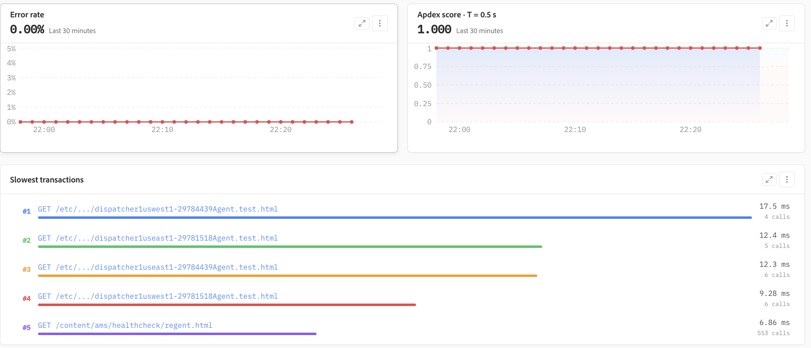

# Applicazioni

Le applicazioni forniscono funzionalità di monitoraggio delle prestazioni delle applicazioni (APM, Application Performance Monitoring), offrendo una visione unificata dello stato, delle prestazioni, delle transazioni e dell&#39;infrastruttura sottostante che supporta ogni servizio. Consente ai team operativi e tecnici di comprendere il comportamento delle applicazioni, identificare i colli di bottiglia delle prestazioni e passare da indicatori di stato di alto livello a singole transazioni per un&#39;analisi più approfondita.

## Riepilogo applicazione

Il riepilogo delle **applicazioni** fornisce una panoramica dell&#39;applicazione selezionata. Indicatori chiave quali latenza p95, throughput del server, tasso di errore e Apdex semplificano la valutazione dello stato dell&#39;applicazione nell&#39;intervallo di tempo selezionato.

I filtri per il tipo di transazione, l’host e la risoluzione consentono di perfezionare la visualizzazione per un’indagine specifica. Le tendenze relative a tempo di risposta e velocità effettiva forniscono ulteriore contesto, aiutando i team a distinguere picchi isolati da modifiche sostenute delle prestazioni.

## Tempo di risposta, throughput e Apdex

Le prestazioni dell’applicazione possono essere valutate utilizzando tempi di risposta percentili insieme al throughput delle richieste. La visualizzazione combinata della latenza p50, p95 e p99 consente di distinguere le esperienze utente tipiche da valori anomali più lenti.

Apdex fornisce una misura complementare della reattività delle applicazioni traducendo le prestazioni del tempo di risposta in un punteggio di soddisfazione di facile comprensione. Insieme al tasso di errore, queste metriche forniscono un’indicazione concisa del fatto che un’applicazione funzioni entro i livelli di prestazioni previsti.

## Errori e lentezza delle transazioni

Le applicazioni presentano in modo continuo le tendenze del tasso di errore e le transazioni lente per aiutare a identificare le richieste che potrebbero influire sulle prestazioni delle applicazioni. La visualizzazione del tasso di errore consente di riconoscere facilmente le modifiche nel tempo, mentre la tendenza Apdex mostra il corrispondente impatto sulla reattività delle applicazioni.

La visualizzazione **Transazioni più lente** evidenzia le transazioni con la durata media più elevata e include il volume di chiamate, semplificando la distinzione tra carichi di lavoro eseguiti di frequente e richieste lente isolate.

## Correlazione tra transazioni e infrastrutture

L’elenco delle transazioni fornisce una visualizzazione mirata dei tipi di transazione più lenti, tra cui la traccia osservata più lenta, il tasso di errore e la durata media. Questo consente ai team di identificare rapidamente i pattern di transazione che richiedono ulteriori indagini.

I dati dell&#39;applicazione sono correlati agli host sottostanti in modo che le prestazioni delle transazioni possano essere valutate insieme agli indicatori dell&#39;infrastruttura, quali il tempo di risposta, il throughput, l&#39;utilizzo dei CPU e l&#39;utilizzo della memoria. Questa correlazione consente di determinare se un problema di prestazioni ha origine nell&#39;elaborazione dell&#39;applicazione o può essere associato all&#39;infrastruttura di supporto.

## Analisi delle prestazioni delle transazioni

La vista analisi delle transazioni classifica le transazioni in base alle caratteristiche delle prestazioni e riepiloga gli indicatori chiave, quali le transazioni che richiedono più tempo, il tempo di risposta p95 più lento, il tasso di errore più alto, la velocità effettiva e il valore Apdex.

Le visualizzazioni di serie temporali mostrano come le transazioni più significative contribuiscono al tempo di elaborazione complessivo e come cambia la velocità effettiva delle richieste nel periodo selezionato. In questo modo è più facile identificare gli endpoint ad alto impatto, confrontare il comportamento delle transazioni e determinare quali richieste esaminare per prime.

## Analisi dei problemi relativi alle prestazioni

Le applicazioni supportano un flusso di lavoro di indagine progressivo: iniziare con indicatori di stato e prestazioni a livello di applicazione, identificare tempi di risposta anomali, errori o modifiche della velocità effettiva e quindi limitare l’indagine alle transazioni che contribuiscono maggiormente al problema. I dati delle transazioni possono essere correlati con le metriche dell’infrastruttura a livello di host.

Questo flusso di lavoro consente ai team di passare in modo efficiente dall&#39;**integrità dell&#39;applicazione → dalla tendenza delle prestazioni → dagli host di → delle transazioni**, riducendo il tempo necessario per isolare l&#39;origine di un problema di prestazioni.
